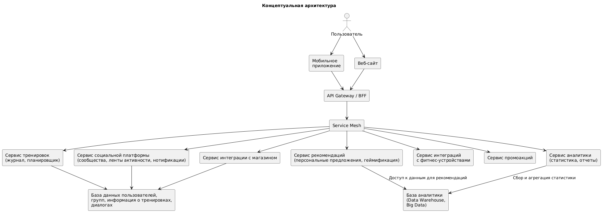

# Концептуальная архитектура

Главные компоненты:
1. API Gateway / BFF.
   * Точка входа для мобильного приложения и веб-сайта. Реализует маршрутизацию запросов к соответствующим сервисам, агрегацию данных.
   * Может дополнительно обеспечивать аутентификацию, авторизацию, фильтрацию и кэширование.
2. Сервис социальной платформы.
   * Управление группами, публикация постов, лента активности, сообщения и уведомления.
   * Отвечает за механизмы геймификации.
3. Сервис тренировок.
   * Ведение журнала тренировок (история, планировщик, уведомления о расписании), сравнение результатов с прошлыми.
4. Сервис аналитики.
   * Расчет и хранение агрегированных метрик: общее время тренировок, прогресс пользователей, сравнение с другими спортсменами.
   * Обеспечивает доступ к дешбордам и подготовку данных для дальнейшего анализа (Data Warehouse/Big Data).
5. Сервис рекомендаций.
   * Персональные рекомендации товаров.
6. Сервис интеграции со сторонними устройствами.
   * Подключение сторонних устройств (датчики ЧСС, шагомеры, фитнес-браслеты).
   * Сбор данных о состоянии пользователя в реальном времени.
7. Сервис интеграции с каталогом товаров.
   * Взаимодействие с уже имеющейся e-commerce системой компании.
8. Сервис промоакций.
   * Управление акциями и предложениями в зависимости от локации, интересов пользователей, сезона и т. д.

## Навигация

1. [Бизнес-цели](https://github.com/f0rw4rd-dev/sb-final-project/blob/main/business_objectives.md)
2. [Функциональные требования](https://github.com/f0rw4rd-dev/sb-final-project/blob/main/functional_requirements.md)
3. [Стейкхолдеры](https://github.com/f0rw4rd-dev/sb-final-project/blob/main/stakeholders.md)
4. [Концептуальная архитектура](https://github.com/f0rw4rd-dev/sb-final-project/blob/main/concept_architecture.md)
5. [Риски реализации](https://github.com/f0rw4rd-dev/sb-final-project/blob/main/implementation_risks.md)
6. [План поэтапной разработки и расширения системы, анализ критически важных компонентов](https://github.com/f0rw4rd-dev/sb-final-project/blob/main/development_plan.md)
7. [Критические бизнес-сценарии](https://github.com/f0rw4rd-dev/sb-final-project/blob/main/critical_business_scenarios.md)
8. [Атрибуты качества](https://github.com/f0rw4rd-dev/sb-final-project/blob/main/quality_attributes.md)
9. [Нефункциональные требования](https://github.com/f0rw4rd-dev/sb-final-project/blob/main/nonfunctional_requirements.md)
10. [Архитектурные опции](https://github.com/f0rw4rd-dev/sb-final-project/blob/main/architectural_options.md)
11. Список ADR
    1. [Выбор микросервисной архитектуры](https://github.com/f0rw4rd-dev/sb-final-project/blob/main/adr_01.md)
    2. [Использование контейнеризации (Docker/Kubernetes)](https://github.com/f0rw4rd-dev/sb-final-project/blob/main/adr_02.md)
    3. [Хранение пользовательских данных](https://github.com/f0rw4rd-dev/sb-final-project/blob/main/adr_03.md)
    4. [Выделение БД для аналитики](https://github.com/f0rw4rd-dev/sb-final-project/blob/main/adr_04.md)
    5. [Аутентификация и авторизация (OAuth2 / OpenID Connect)](https://github.com/f0rw4rd-dev/sb-final-project/blob/main/adr_05.md)
    6. [Наблюдаемость (Observability)](https://github.com/f0rw4rd-dev/sb-final-project/blob/main/adr_06.md)
    7. [Использование Kafka в качестве основного брокера сообщений](https://github.com/f0rw4rd-dev/sb-final-project/blob/main/adr_07.md)
12. [Описание сценариев использования приложения](https://github.com/f0rw4rd-dev/sb-final-project/blob/main/use_cases.md)
13. [Базовая архитектура](https://github.com/f0rw4rd-dev/sb-final-project/blob/main/basic_architecture.md)
14. [Основные представления](https://github.com/f0rw4rd-dev/sb-final-project/blob/main/views.md)
15. [Анализ рисков созданной архитектуры, компромиссов](https://github.com/f0rw4rd-dev/sb-final-project/blob/main/architecture_risks.md)
16. [Стоимость владения системой](https://github.com/f0rw4rd-dev/sb-final-project/blob/main/costs.md)