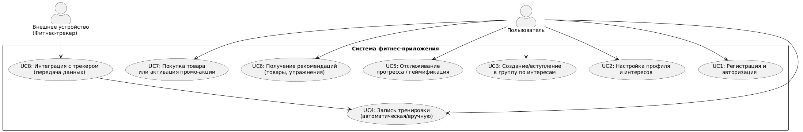

# Описание сценариев использования приложения

## Сценарий UC1: Регистрация и авторизация
1. Акторы:
   * Пользователь.
   * Система фитнес-приложения.
2. Цель:
   * Новый пользователь хочет создать учетную запись в приложении, а затем авторизоваться.
3. Предварительные условия:
   * Приложение установлено на смартфон пользователя или пользователь открыл веб-версию.
   * Доступ к интернету.
4. Основной поток:
   1. Пользователь выбирает "Регистрация".
   2. Система предлагает заполнить базовые данные (e-mail, пароль) или войти через соц. сеть (OAuth2).
   3. Пользователь подтверждает регистрацию (получение кода по e-mail / SMS).
   4. После успешной валидации система создает новый профиль пользователя.
   5. Пользователь проходит аутентификацию в системе (логин/пароль или OAuth2-токен).
5. Результат:
   * Создана учетная запись, пользователь авторизован и может приступать к настройке профиля.
6. Исключения:
   * Некорректный e-mail/пароль, проблемы с интернетом.
   * Недоступен сервис авторизации.

## Сценарий UC2: Настройка профиля и интересов
1. Акторы:
    * Пользователь.
    * Система фитнес-приложения.
2. Цель:
   * Пользователь хочет указать свои спортивные интересы и предпочтения (вид спорта, цели тренировок, график). Это важно для персонализации рекомендаций и формирования релевантного контента.
3. Предварительные условия:
   * Пользователь зарегистрировался и авторизовался в системе (см. UC1).
4. Основной поток:
   1. Пользователь переходит в раздел "Настройки профиля".
   2. Вводит данные о своем уровне подготовки, предпочитаемых видах спорта (бег, йога, плавание и т. д.), доступном инвентаре.
   3. При желании настраивает цели (например, сбросить вес, пробежать марафон, улучшить гибкость).
   4. Система сохраняет введенные данные в БД.
5. Результат:
   * Профиль пользователя содержит актуальную информацию об интересах и целях.
   * Система может использовать эти данные для персональных рекомендаций (см. UC6).
6. Исключения:
   * Пользователь прерывает настройку, данные остаются неполными.
   * Ошибки валидации (некорректный формат ввода).

## Сценарий UC3: Создание/вступление в группу по интересам
1. Акторы:
    * Пользователь.
    * Система фитнес-приложения.
2. Цель:
   * Организовать социальное взаимодействие, позволяя пользователям создавать и находить группы (например, "Бег по утрам", "Любители йоги").
3. Предварительные условия:
   * Пользователь авторизован.
   * Система располагает функционалом социальных групп.
4. Основной поток:
   1. Пользователь переходит в раздел "Группы по интересам".
   2. Пользователь либо находит существующую группу (по ключевым словам, локации, виду спорта), либо нажимает "Создать группу".
   3. В случае создания новой группы система запрашивает название, описание, настройки приватности (публичная/приватная), возможные теги.
   4. После сохранения группа появляется в общем каталоге (если она публичная) или доступна по приглашениям (если приватная).
   5. При вступлении пользователь нажимает "Присоединиться"; если группа публичная - присоединение происходит сразу, если приватная - отправляется запрос на одобрение администратору группы.
5. Результат:
   * Пользователь либо создал новую группу, либо вступил в уже существующую.
   * В ленте пользователя и участников группы отображаются активности, связанные с группой.
6. Исключения:
   * Группа приватная и пользователь не получил одобрение.
   * Некорректные данные при создании группы (например, уже существует группа с таким названием).

## Сценарий UC4: Запись тренировки (автоматическая/вручную)
1. Акторы: 
   * Пользователь.
   * Внешнее устройство.
   * Система фитнес-приложения.
2. Цель:
   * Пользователь фиксирует свою тренировку, чтобы получать аналитику.
3. Предварительные условия:
   * Пользователь авторизован в приложении.
   * При автоматическом учете: настроена интеграция с фитнес-трекером.
4. Основной поток (автоматический учет):
   1. Пользователь начинает тренировку, фитнес-трекер собирает данные (ЧСС, шаги, дистанция).
   2. По окончании тренировки трекер синхронизируется с приложением.
   3. Система получает данные, сохраняет их в БД.
   4. Пользователь может открыть приложение и увидеть новую запись с данными (дистанция, время, калории, графики ЧСС).
5. Основной поток (ручной ввод):
   1. Пользователь заходит в "Добавить тренировку" в приложении.
   2. Вводит тип тренировки, длительность, расстояние (если есть).
   3. Система сохраняет данные и рассчитывает базовые показатели (калории и т. п.).
6. Результат:
   * Тренировка успешно зафиксирована и отображается в профиле пользователя.
7. Исключения:
   * Приложение не получило данные от трекера (ошибка синхронизации).
   * Неверные данные при ручном вводе (например, нереалистичные показатели).

## Сценарий UC5: Отслеживание прогресса / геймификация
1. Акторы:
    * Пользователь.
    * Система фитнес-приложения.
2. Цель:
   * Мотивировать пользователя, показывая динамику прогресса, достижения и награды (бейджи, уровни).
3. Предварительные условия:
   * Пользователь имеет хотя бы одну записанную тренировку (см. UC4).
   * В системе настроен сервис геймификации.
4. Основной поток:
   1. Пользователь переходит в раздел "Мой прогресс" или открывает главную ленту, где показаны последние достижения.
   2. Система анализирует данные о тренировках и сравнивает с историческими результатами.
   3. Отображаются ключевые метрики (количество тренировок, суммарная дистанция, рекордное время и т. д.).
   4. Если пользователь достиг нового уровня/бейджа (например, "Пробежал 100 км в сумме"), система уведомляет об этом (push-уведомление, статус в ленте).
   5. При желании пользователь может поделиться достижением в социальной группе или в личном профиле.
5. Результат:
   * Пользователь видит свою динамику и получает "награды", повышается мотивация и вовлеченность.
6. Исключения:
   * Если сервис аналитики недоступен, может быть задержка в обновлении данных.
   * Временные ошибки синхронизации тренировок (данные отображаются не сразу).

## Сценарий UC6: Получение рекомендаций (товары, упражнения)
1. Акторы:
    * Пользователь.
    * Система фитнес-приложения.
2. Цель:
   * Пользователь хочет получить персональные советы по тренировкам или подбор спортивных товаров.
3. Предварительные условия:
   * У пользователя уже есть история тренировок (система может анализировать прогресс).
   * Есть доступ к интернету.
4. Основной поток:
   1. Пользователь заходит в раздел "Рекомендации".
   2. Сервис рекомендаций анализирует данные о тренировках, инвентарь, профили активности.
   3. Система выводит рекомендации:
      * Упражнения/планы тренировок, основанные на предыдущих результатах.
      * Товары, релевантные пользователю (например, новая модель кроссовок, если у пользователя пробег в старой обуви уже большой).
   4. Пользователь может просмотреть детали и при желании перейти в каталог товаров (см. UC7).
5. Результат:
   * Пользователь получил актуальные персональные рекомендации.
6. Исключения:
   * Недостаточно данных для персонализации (новый пользователь).
   * Временная недоступность сервисов аналитики или рекомендаций.

## Сценарий UC7: Покупка товара или активация промо-акции
1. Акторы:
    * Пользователь.
    * Система фитнес-приложения.
2. Цель:
   * Пользователь хочет купить товар, рекомендуемый системой, или воспользоваться промо-акцией.
3. Предварительные условия:
   * Пользователь авторизован.
   * Товар/акция доступны в регионе пользователя.
4. Основной поток:
   1. Пользователь нажимает на предложение (товар или промо) в разделе рекомендаций.
   2. Система перенаправляет запрос в E-commerce сервис.
   3. Открывается окно с подробной информацией (цена, доставка).
   4. Пользователь оформляет заказ (выбор способа оплаты, адрес доставки).
   5. Система подтверждает заказ, отправляет уведомление о покупке.
5. Результат:
   * Товар приобретен, пользователь получает подтверждение.
6. Исключения:
   * Недостаточно средств на счете, не прошла оплата.
   * Товар недоступен в регионе или закончился на складе.

## Сценарий UC8: Интеграция с трекером (передача данных)
1. Акторы:
   * Внешнее устройство (фитнес-трекер).
   * Пользователь.
   * Система фитнес-приложения.
2. Цель:
   * Автоматизировать сбор данных о тренировках и состоянии пользователя (ЧСС, шаги, калории) из носимых устройств.
3. Предварительные условия:
   * Пользователь авторизован в приложении и дал согласие/доступ на чтение данных с трекера.
   * Устройство и приложение могут взаимодействовать напрямую (Bluetooth) или через облако производителя.
4. Основной поток:
   1. Пользователь в настройках приложения выбирает опцию "Подключить устройство" и проходит авторизацию в соответствующем сервисе.
   2. Сервис интеграции получает ключи доступа и регистрирует устройство.
   3. Во время тренировки трекер собирает данные и отправляет их в облачный сервис производителя или напрямую (если локальное BLE-соединение).
   4. Система периодически (или в реальном времени) запрашивает данные об активности пользователя из внешнего сервиса.
   5. Данные о тренировках сохраняются в БД.
5. Результат:
   * Пользователь видит свои тренировки и показатели в приложении без ручного ввода.
6. Исключения:
   * Сбой авторизации с сервисом-провайдером трекера (невалидные токены).
   * Устройство не синхронизируется из-за отсутствия сети или проблем на стороне производителя.

## Навигация

1. [Бизнес-цели](https://github.com/f0rw4rd-dev/sb-final-project/blob/main/business_objectives.md)
2. [Функциональные требования](https://github.com/f0rw4rd-dev/sb-final-project/blob/main/functional_requirements.md)
3. [Стейкхолдеры](https://github.com/f0rw4rd-dev/sb-final-project/blob/main/stakeholders.md)
4. [Концептуальная архитектура](https://github.com/f0rw4rd-dev/sb-final-project/blob/main/concept_architecture.md)
5. [Риски реализации](https://github.com/f0rw4rd-dev/sb-final-project/blob/main/implementation_risks.md)
6. [План поэтапной разработки и расширения системы, анализ критически важных компонентов](https://github.com/f0rw4rd-dev/sb-final-project/blob/main/development_plan.md)
7. [Критические бизнес-сценарии](https://github.com/f0rw4rd-dev/sb-final-project/blob/main/critical_business_scenarios.md)
8. [Атрибуты качества](https://github.com/f0rw4rd-dev/sb-final-project/blob/main/quality_attributes.md)
9. [Нефункциональные требования](https://github.com/f0rw4rd-dev/sb-final-project/blob/main/nonfunctional_requirements.md)
10. [Архитектурные опции](https://github.com/f0rw4rd-dev/sb-final-project/blob/main/architectural_options.md)
11. Список ADR
    1. [Выбор микросервисной архитектуры](https://github.com/f0rw4rd-dev/sb-final-project/blob/main/adr_01.md)
    2. [Использование контейнеризации (Docker/Kubernetes)](https://github.com/f0rw4rd-dev/sb-final-project/blob/main/adr_02.md)
    3. [Хранение пользовательских данных](https://github.com/f0rw4rd-dev/sb-final-project/blob/main/adr_03.md)
    4. [Выделение БД для аналитики](https://github.com/f0rw4rd-dev/sb-final-project/blob/main/adr_04.md)
    5. [Аутентификация и авторизация (OAuth2 / OpenID Connect)](https://github.com/f0rw4rd-dev/sb-final-project/blob/main/adr_05.md)
    6. [Наблюдаемость (Observability)](https://github.com/f0rw4rd-dev/sb-final-project/blob/main/adr_06.md)
12. [Описание сценариев использования приложения](https://github.com/f0rw4rd-dev/sb-final-project/blob/main/use_cases.md)
13. [Базовая архитектура](https://github.com/f0rw4rd-dev/sb-final-project/blob/main/basic_architecture.md)
14. [Основные представления](https://github.com/f0rw4rd-dev/sb-final-project/blob/main/views.md)
15. [Анализ рисков созданной архитектуры, компромиссов](https://github.com/f0rw4rd-dev/sb-final-project/blob/main/architecture_risks.md)
16. [Стоимость владения системой](https://github.com/f0rw4rd-dev/sb-final-project/blob/main/costs.md)